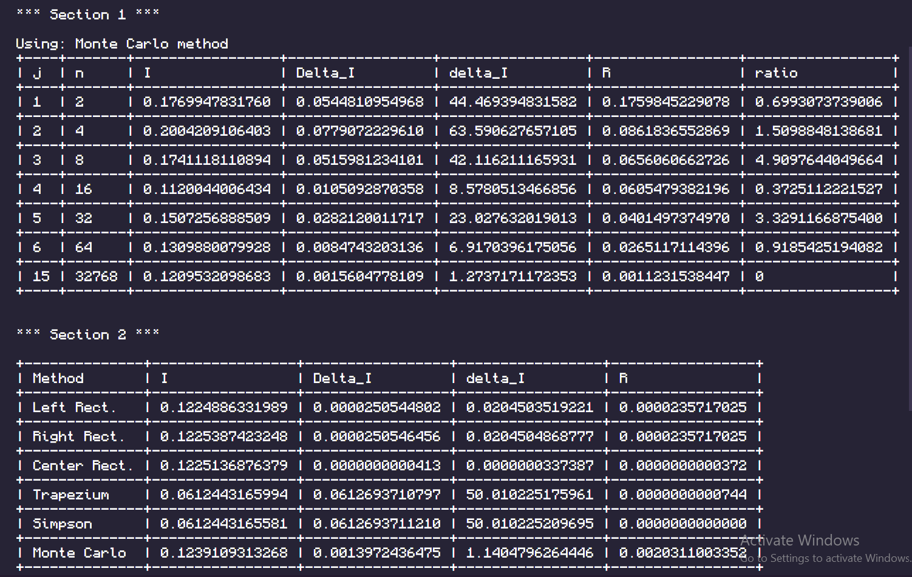

# 4th Lab: Numerical Integration

>
> ## Function
>
> y = x^2+log(x) (log in base 10).
>

## Section 1

The goal is to analyse the behaviour of the results of our method of choice
(in this case, Monte Carlo method) to see if the error decreases as expected.

The different values of `n` used are the powers of 2 from 2^1 to 2^15.

## Section 2

Here we compare all methods and their error when `n = 10000`

## Results

