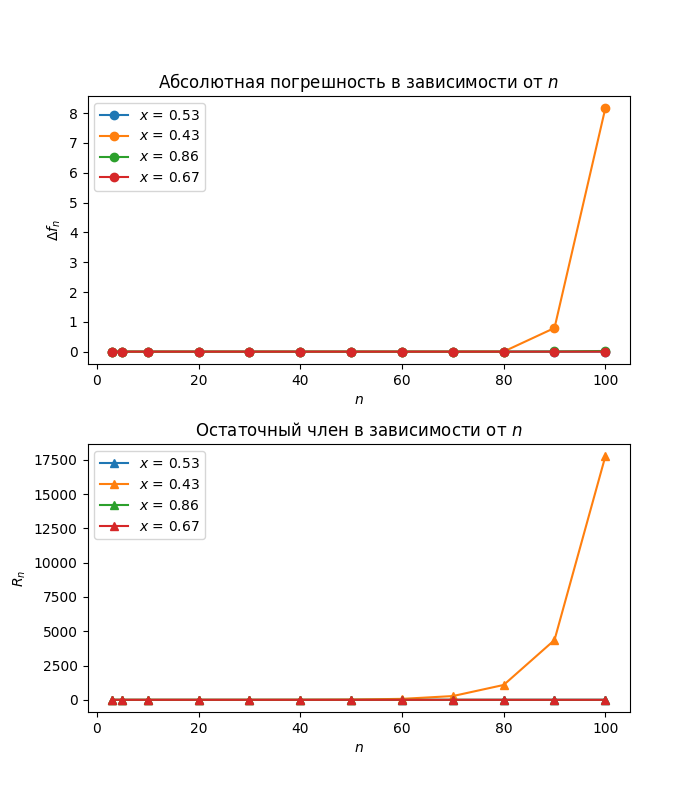

# _1st Lab_: Lagrange Polynomial

> ### Variant
>
> 19
>
> ### Function
>
> y = x^2+log(x) (log in base 10).
>
> ### Interval
>
> [a, b] = [0.4, 0.9]
>
> ### Interpolation points
>
> {x\*, x**, x\***, x\*\*\*\*} = {0.53, 0.43, 0.86, 0.67}

## Goal

Do an analysis and graphical representation of the error of an interpolation using the Lagrange polynomial method.

## Usage

Set the input data in `./data/input/data.json` where you can set the `n_values`, `x_interval` and `x_values`. Be careful cause an interval can only consist of two numbers. `data.json` looks as follows:

    {
        "n_values": [3, 5, 10, 20, 30, 40, 50],
        "x_interval": [0.4, 0.9],
        "x_values": [0.53, 0.43, 0.86, 0.67]
    }

Run `py ./python/main.py` and check the results in `./data/output`.

> _Warning:_ Change the `DATA_DIR` constant as specified in the `main.rs` file if you run `cargo run` in `./rust`

## Result

